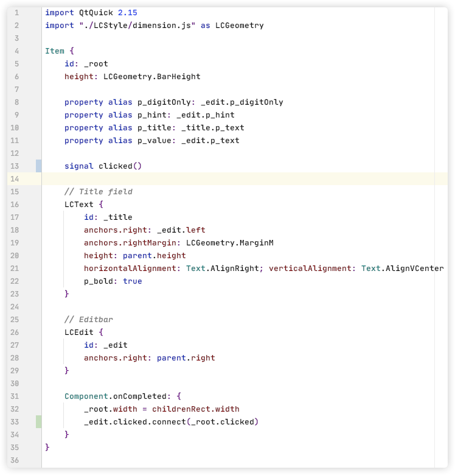
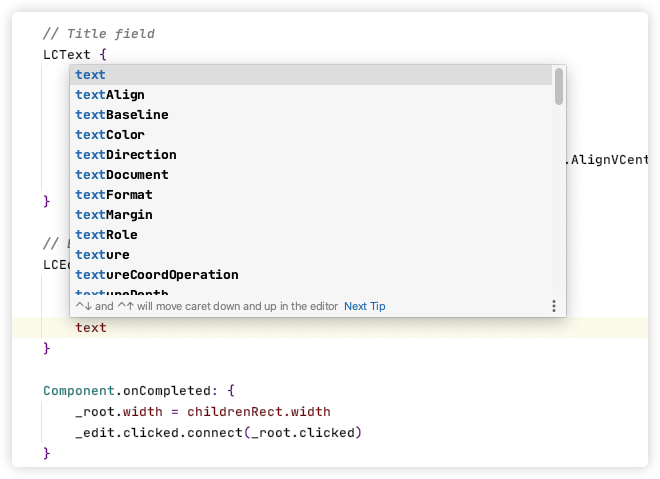
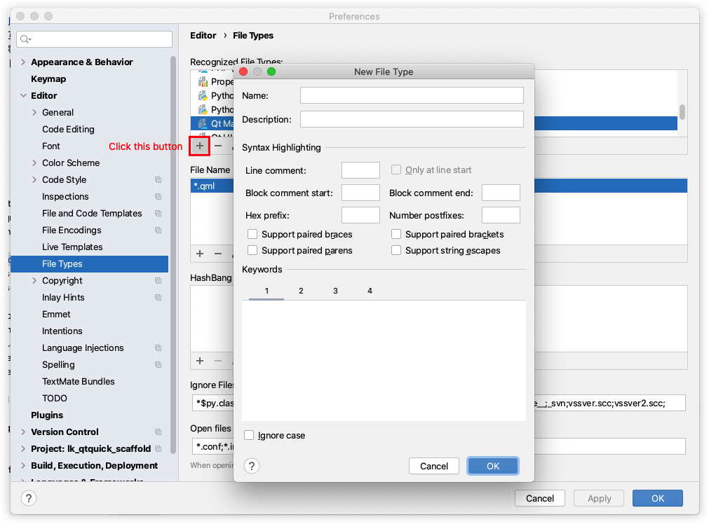
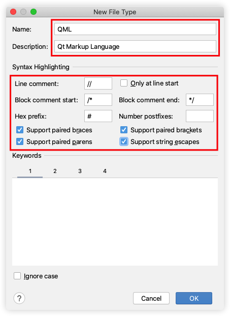
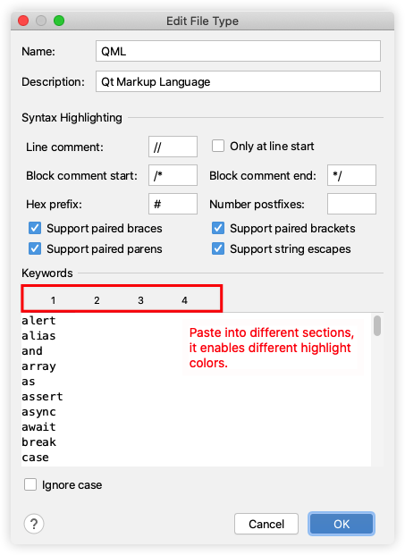
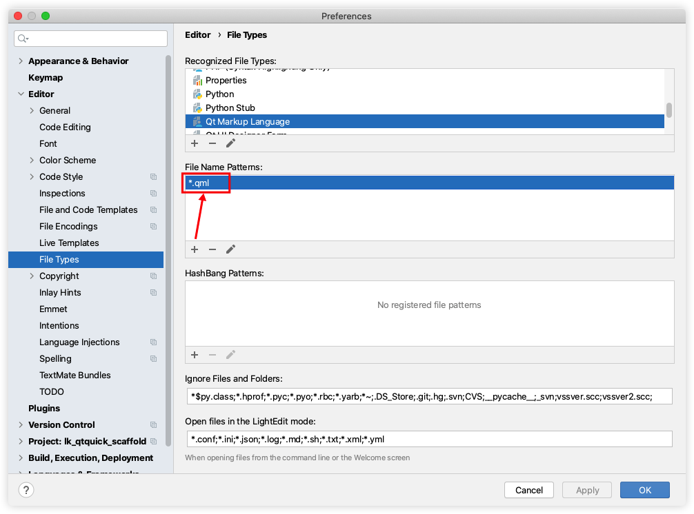

# Intro

Keywords and syntax hightlight for QML (Qt markup language) in Pycharm.

It also provides code completion hint for you:

# How to use

1. Download 'export/pycharm_qml_keywords_highlight.md' to local

2. Open Pycharm settings - Editor - File Types, click the 'add' button. You will see the dialog pane

   

3. Enable options like below

   

4. Open the downloaded file, and copy its content, paste to Pycharm dialog pane like below

   

5. And add `*.qml` file types here

   

6. Now you can see the code highlighted in .qml
